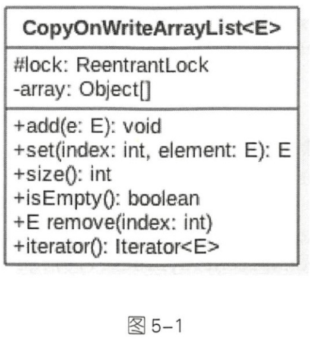
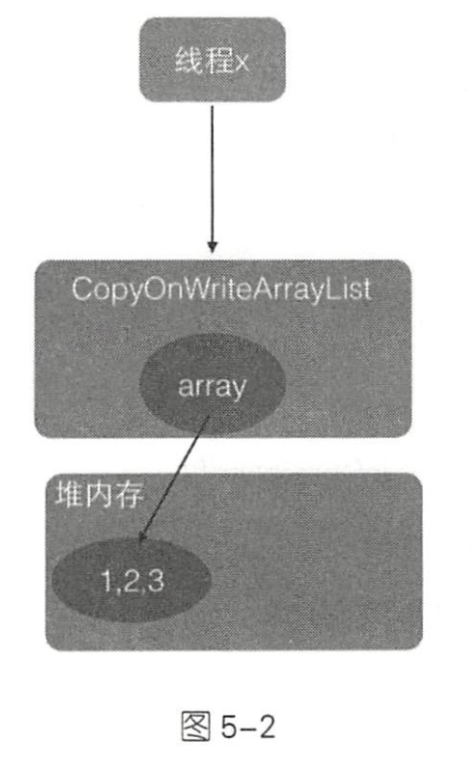
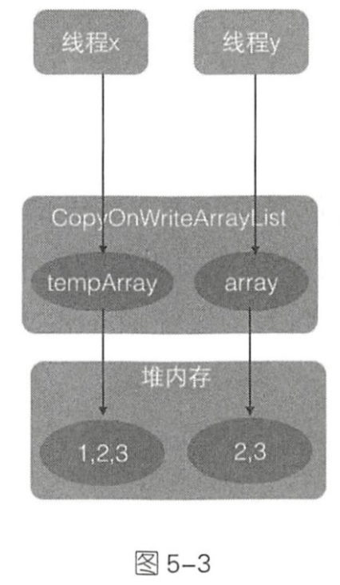

# Java并发包中并发List源码剖析

## 目录

- [介绍](#1)
- [主要源码介绍](#)
  - [初始化](#3)
  - [添加元素](#4)
  - [获取指定位置元素](#5)
  - [修改指定元素](#6)
  - [删除元素](#7)
  - [弱一致性的迭代器](#8)
- [总结](#9)

<h2 id='1'>介绍</h2>

并发包中的并发List只有CopyOnwriteArrayList。CopyOnWriteArrayList是一个线程安全的ArrayList，对其进行修改操作都是在底层的的一个复制的数组上进行的，也就是使用了写时复制的策略。



在CopyOnWriteArrayList的类图中，每个CopyOnWriteArrayList对象里面有一个array数组对象用来存放具体元素，ReentrantLock独占锁对象用来保证同时只有一个线程对array进行修改。这里只要记得ReentrantLock是独占锁，同时只有一个线程可以获取就可以了，后面会专门对JUC的锁进行介绍。

如果让我们自己做一个写时复制的线程安全的list，我们会怎么做，有哪些点需要考虑？

- 何时初始化list，初始化的list元素个数有多少，list是有限大小吗？
- 如何保证线程安全，比如多个线程进行读写时如何保证线程是安全的？
- 如何保证使用迭代器遍历list时的数据一致性？

<h2 id='3'>主要方法源码介绍 </h2>

<h3 id='4'>初始化</h3>

无参构造函数在内部创建了一个大小为0的Object数组作为array的初始值

```java
public CopyWriteArrayList(){
	setArray(new Object[0]);
}
```

有参构造函数

```java
// 根据传入数组创建array对象
public CopyOnWriteArrayList(E[] toCopyIn) {
    setArray(Arrays.copyOf(toCopyIn, toCopyIn.length, Object[].class));
}

// 根据集合创建array对象
public CopyOnWriteArrayList(Collection<? extends E> c) {
    Object[] elements;
    if (c.getClass() == CopyOnWriteArrayList.class)
        elements = ((CopyOnWriteArrayList<?>)c).getArray();
    else {
        elements = c.toArray();
        // c.toArray might (incorrectly) not return Object[] (see 6260652)
        if (elements.getClass() != Object[].class)
            elements = Arrays.copyOf(elements, elements.length, Object[].class);
    }
    setArray(elements);
}
```

关于“c.toArray might (incorrectly) not return Object[] (see 6260652)”的注释可参考[《JDK1.6集合框架bug：c.toArray might (incorrectly) not return Object[] (see 6260652)》](https://blog.csdn.net/aitangyong/article/details/30274749)。

<h3 id='4'>添加元素</h3>

CopyOnWriteList中用来添加元素的函数有add(E e)、add(int index, E element)、addIfAbsent(E e)等，其原理类似，下面以add(E e)为例进行讲解。

```java
public boolean add(E e) {
    // 获取独占锁(1)
    final ReentrantLock lock = this.lock;
    lock.lock();
    try {
        //(2) 获取array
        Object[] elements = getArray();
        // (3)复制array到新数组，并将新元素添加到新数组
        int len = elements.length;
        Object[] newElements = Arrays.copyOf(elements, len + 1);
        newElements[len] = e;
        // (4)用新数组代替原来的数组
        setArray(newElements);
        return true;
    } finally {
      //(5)释放独占锁
        lock.unlock();
    }
}

```

如上代码中，调用add方法的线程会首先执行代码（1）去获取独占锁，如果多个线程都调用add方法只有一个线程会获取到该锁，其他线程会被阻塞挂起知道锁被释放。

所以一个线程获取到锁后，就保证了在该线程添加元素的过程中其他线程不会对array进行修改。

线程获取锁后执行代码（2）获取array，然后执行代码（3）复制一个array到新数组（这里我们可以看到新数组的大小是原来的数组加1，所以CopyOnWriteArrayList是无界list），并把新增的元素添加到新数组。

然后执行代码（4）使用新数组代替原数组，并在返回前释放锁，由于加了锁，所以整个add过程是原子性操作。需要注意的是，在添加元素的时候，首先复制了一个快照，然后在快照上进行添加，而不是直接在原数组上进行。

<h3 id='5'>获取指定位置元素</h3>

使用E get(int index)获取下标为index的元素，如果元素不存在则抛出IndexOutOfBoundException异常。

```java
public E get(int index) {
    return get(getArray(), index);
}

private E get(Object[] a, int index) {
    return (E) a[index];
}

final Object[] getArray() {
    return array;
}

```

当线程X调用get方法获取指定位置的元素时需要两步：A：首先获取array数组，B：通过下标访问指定位置的元素。整个过程没有加锁同步，可能出现弱一致的问题。假设这时候List的内容如图5-2所示，里面有1、2、3三个元素



由于执行步骤A和步骤B没有加锁，这就可能导致在线程x执行完步骤A后执行步骤B前，另外一个线程y进行了remove操作，假设要删除元素1。remove操作首先或获取独占锁，然后进行写时复制操作，也就是复制一份当前array数组，然后在复制的数组里面删除线程x通过get方法要访问的元素1，然后让array指向复制的数组。而这时候array之前指向的数组的引用计数为1而不是0，因为线程x还在使用它，这时候线程x开始执行步骤B，步骤B操作的数组是线程y删除元素之前的数组，如图5-3所示



虽然线程y已经删除了index处的元素，但是线程x的步骤还是会返回index处的元素，这其实就是写时复制策略产生的弱一致性问题。

<h3 id='6'>修改指定元素</h3>

使用E set(int index, E element)方法修改指定元素的值，如果指定位置的元素不存在则抛出IndexOutOfBoundsException异常：

```java
public E set(int index, E element) {
    final ReentrantLock lock = this.lock;
    lock.lock();
    try {
        Object[] elements = getArray();
        E oldValue = get(elements, index);

        if (oldValue != element) {
            int len = elements.length;
            Object[] newElements = Arrays.copyOf(elements, len);
            newElements[index] = element;
            setArray(newElements);
        } else {
            // Not quite a no-op; ensures volatile write semantics
            setArray(elements);
        }
        return oldValue;
    } finally {
        lock.unlock();
    }
}

```

首先获取独占锁，从而阻止其他线程对array数组进行修改，然后获取当前数组，并调用get方法获取指定位置的元素，如果指定位置的元素值与新值不一致就创建新数组并复制元素，然后在新数组上修改指定位置的元素值并设置新数组到array。即使指定位置的元素值与新值一样，为了保证volatile语义，也需要重新设置array（此处可参看[《CopyOnWriteArrayList与java内存模型》](https://blog.csdn.net/cumtwyc/article/details/52267414)）。

<h3 id='7'>删除元素</h3>

删除list里的元素，可以使用E remove(int index)、boolean remove(Object o)和boolean remove(Object o, Object[] snapshot, int index)等方法，其原理类似，下面以remove(int index)为例进行讲解。

```java
public E remove(int index) {
    final ReentrantLock lock = this.lock;
    lock.lock();
    try {
        Object[] elements = getArray();
        int len = elements.length;
        E oldValue = get(elements, index);
        int numMoved = len - index - 1;
        if (numMoved == 0)
            setArray(Arrays.copyOf(elements, len - 1));
        else {
            Object[] newElements = new Object[len - 1];
            System.arraycopy(elements, 0, newElements, 0, index);
            System.arraycopy(elements, index + 1, newElements, index,
                                numMoved);
            setArray(newElements);
        }
        return oldValue;
    } finally {
        lock.unlock();
    }
}
```

 如上代码和新增元素代码类似，首先获取独占锁以保证删除数据器件其他线程不能对array进行修改，然后获取数组中要被删除的元素，并把剩下的元素复制到新数组，之后使用新数组替换原来的数组，最后在返回前释放锁。

<h3 id='8'>弱一致性的迭代器</h3>

弱一致性是指返回迭代器后，其他线程对list的增删改对迭代器是不可见的，

```java
public Iterator<E> iterator() {
    return new COWIterator<E>(getArray(), 0);
}

static final class COWIterator<E> implements ListIterator<E> {

    // array的快照
    private final Object[] snapshot;
    // 数组下标
    private int cursor;
		//构造函数
    private COWIterator(Object[] elements, int initialCursor) {
        cursor = initialCursor;
        snapshot = elements;
    }
		//是否遍历结束
    public boolean hasNext() {
        return cursor < snapshot.length;
    }
		//获取元素
    public E next() {
        if (! hasNext())
            throw new NoSuchElementException();
        return (E) snapshot[cursor++];
    }
}
```

在上面的代码中，当调用iterator()方法获取迭代器时实际上会返回一个COWIterator对象，COWIterator对象的snapshot变量保存了当前list的内容，cursor是遍历list时数据的下标。为什么说snapshot是list的快照呢？明明是指针传递的饮用啊，而不是副本。如果在该线程使用返回的迭代器遍历元素的过程中，其他线程没有对list尽心增删改，那么snapshot本身就是list的array，因为它们是引用关系。但是如果在遍历器件其他线程对list进行了增删改，那么snapshot就是快照了，因为增删改后list里面的数组被新数组替换了，这时候老数组被snapshot引用。这也说明获取迭代器后，使用该迭代器元素时，其他线程对list进行的增删改不可见，因为它们操作的是两个不同的数组，这就是弱一致性。

下面是一个弱一致性的示例

```java
public class copylist {
    private static volatile CopyOnWriteArrayList<String> arrayList=new CopyOnWriteArrayList<>();
    public static void main(String[]args) throws InterruptedException{
        arrayList.add("hello");
        arrayList.add("alibaba");
        arrayList.add("welcome");
        arrayList.add("to");
        arrayList.add("hangzhou");

        Thread threadOne=new Thread(new Runnable() {
            @Override
            public void run() {
                //修改list中下标为1的原物为baba
                arrayList.set(1,"baba");
                //删除元素
                arrayList.remove(2);
                arrayList.remove(3);
            }
        });

        //保证在修改线程启动前获取迭代器
        Iterator <String>itr= arrayList.iterator();
        //启动线程
        threadOne.start();
        //等待线程执行完毕
        threadOne.join();
				//迭代元素
        while(itr.hasNext()){
            System.out.println(itr.next());
        }
    }
}
```

主线程在子线程执行完毕后使用获取的迭代器遍历元素，从输出结果我们可以得知，在子线程里面进行的操作没有一个生效，这就是迭代器弱一致性的体现。需要注意的是，获取迭代器的操作要在子线程操作之前。

<h2 id='9'>总结</h2>

CopyOnWriteArrayList使用写时复制的策略来保证 list的一致性，而获取一修改一写入三步操作并不是原子性的，所以在增删改的过程中都使用了独占锁，来保证在某个时间只有一个线程能对list数组进行修改。 另外 CopyOnWriteAn·ayList提供了弱一致性的迭代器，从而保证在获取迭代器后，其他线程对 list 的修改是不可见的，迭代器遍历的数组是一个快照。 另外，CopyOnWriteArraySet的底层就是使用它实现的，感兴趣的读者可以查阅相关源码 。

