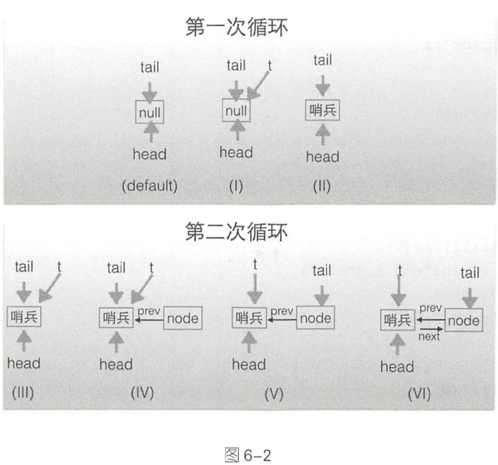

# 第六章：Java并发包中锁原理剖析

## 目录

- [LockSupport工具类](#1)
  - [void park()](#2)
  - [void unpark(Thread thread)](#3)
  - [void parkNanos(long nanos)](#4)
- [抽象同步队列AQS概述](#5)
  - [AQS-锁的底层支持](#6)
  - [AQS-条件变量的支持](#7)
  - [基于AQS实现自定义同步器](#8)
- [独占锁ReentrantLock的原理](#9)
  - [类图结构](#10)
  - [获取锁](#11)
  - [释放锁](#12)
  - [案例介绍](#13)
  - [小结](#14)
- [读写锁ReentrantReadWriteLock的原理](#15)
  - [类图结构](#16)
  - [写锁的获取与释放](#17)
  - [读锁的获取与释放](#18)
  - [案例介绍](#19)
- [JDK8中新增的SteampedLock锁探究](#20)
  - [概述](#21)
  - [案例介绍](#22)
  - [小结](#23)

## LockSupprot工具类

LockSupport是rt.jar包的工具类，主要作用是挂起和唤醒线程，该工具类是创建锁和其他同步类的基础。

LockSupport类与每个使用它的线程都会关联一个许可证，在默认情况下调用LockSupport类的方法的线程是不持有许可证的。LockSupport是使用Unsafe类实现的

下面介绍LockSupport类中的几个主要函数。

<h3 id=''>1.void park()</h3>
如果调用park方法的线程已经拿到了与LockSupport关联的许可证，则调用LockSupport.part()方法会马上返回，否则调用线程会被禁止参加线程的调度，也就是会被阻塞挂起。

如下代码直接在main函数里面调用park方法，最终只会输出 "begin park！"，然后当前线程被挂起，这时因为在默认情况下调用线程是不持有许可证的。

```java
public static void main(String[] args) {
    System.out.println("begin park!");
    LockSupport.park();
    System.out.println("end park!");
}
```

在其他线程调用unpark(Thread thread) 方法并且将当前线程作为参数时，调用park方法而被阻塞的线程会返回。另外，如果其他线程调用了阻塞线程的interrupt()方法，设置了中断标志或者线程被虚假唤醒，则阻塞线程也会返回。所以在调用park方法时最好也使用循环条件判断方式。

<h3 id='3'>2.void unpark(Thread thread)</h3>
当一个线程调用unpark时，如果参数thread线程没有持有thread与LockSupport类相关联的许可证，则让thread线程持有。如果thread因调用park()而被挂起，则unpark方法会使其被唤醒。如果thread之前没有调用park，则调用unpark方法后再调用park方法会立即返回，代码如下。

```java
public static void main(String[] args) {
    System.out.println("begin park!");
    LockSupport.unpark(Thread.currentThread());
    LockSupport.park();
    System.out.println("end park!");
}
```

输出如下：

```java
begin park!
end park!
```

下面再来看一个例子加深我们的理解：

```java
public class ParkAndUnparkTest {

    public static void main(String[]args) throws  InterruptedException{
        Thread thread1=new Thread(new Runnable() {
            @Override
            public void run() {
                System.out.println("thread park");
                LockSupport.park();
                System.out.println("thread unpark");
            }
        });
        thread1.start();
        Thread.sleep(1000);
        System.out.println("main thread begin unpark");
        LockSupport.unpark(thread1);
    }
}
```

<h3 id='4'>3.void parkNanos(long nanos)</h3>
和 park方法类似，如果调用 park方法的线程已经拿到了与 LockSupport关联的许可证，
则调用 LockSupport.parkNanos(long nanos)方法后会马上返回。该方法的不同在于 ，如果
没有拿到许可 证，则调用线 程会被挂起 nanos 时间 后修改为自动返回。

<h2 id='5'>抽象同步队列AQS概述</h2>

<h3 id='6'>AQS-锁的底层支持</h3>

AbstractQueuedSynchronizer 抽象同步队列简称 AQS，它是实现同步器的基础组件，并发包中锁的底层就是使用 AQS 实现的。AQS的类图如图6-1所示


AQS是一个FIFO的双向队列，其内部通过节点head和tail记录队尾和队首元素，队列元素类型是Node。

Node是AQS的一个静态内部类，属性SHARED和EXCLUSIVE分别代表用来标识线程是获取共享资源和独占资源时被阻塞挂起放入AQS队列的。其中Node的thread变量用来存放进入AQS队列里面的线程；waitStatus用来记录当前线程的状态，CANCELLED表示线程被取消，SIGNAL表示线程需要唤醒，CONDITION表示线程在条件队列里面等待，PROPAGATE表示释放共享资源需要通知其他节点；prev记录当前节点的前驱节点，next记录当前节点的后继节点。

AQS维护了一个单一的状态信息的state，可以通过getState、setState、compareAndSetState函数修改其值

AQS有个内部类 ConditionObject， 用来结合锁实现线程同步。

AQS实现线程同步的关键是对state进行操作，根据state是否属于一个线程，操作state的方式可分为独占方式和共享方式。

独占方式下获取和释放资源的方法为：

> void acquire(int arg) void acauireInterruptibly(int arg) boolean release(int arg)

共享方式下获取和释放资源的方法为：

> void acauireShared(int arg) void acauireSharedInterruptibly(int arg) boolean releaseShared(int arg)

使用独占方式获取的资源是与具体线程绑定的，就是说如果 一 个 线程获取到了资源，就会标记是这个线程获取到了，其他线程再尝试操作 state 获取资源时会发现当前该资源不是自己持有的，就会在获取失败后被阻塞 。 比如独占锁 ReentrantLock 的实现， 当一个线程获取了Reer rantLock的锁后，在AQS内部会首先使用CAS操作把state状态值从0变为 1，然后设置当前锁的持有者为当前线程，当该线程再次获取锁时发现它就是锁的持有者，则会把状态值从 1 变为 2，也就是设置可重入次数，而当另外一个线程获取锁时发现自己并不是该锁的持有者就会被放入 AQS 阻塞队列后挂起

对应共享方式的资源与具体线程是不相关的，当多个线程去请求资源时通过 CAS 方式竞争获取资源，当 一个线程获取到了资源后，另外一个线程再次去获取 时如果 当前资源还能满足它的需要，则当前线程只需要使用 CAS 方式进行获取即可 。 比如 Semaphore 信号量， 当一个线程通过 acquire()方法获取信号量时，会首先看当前信号量个数是否满足需要，不满足则把当前线程放入阻塞队列，如果满足则通过自旋CAS获取信号量。

独占方式下，获取和释放资源的流程如下：

(1)当一个线程调用acquire(int arg)获取独占资源时，会首先使用tryAcquire方法进行尝试，具体就是设置state的值，成功则世界返回，失败则将当前线程封装为类型为Node.EXCLUSIVE的Node节点后插入到AQS阻塞队列的尾部，并调用LockSupport.park(this)挂起自己。

```java
public final void acquire(int arg) {
    if (!tryAcquire(arg) &&
        acquireQueued(addWaiter(Node.EXCLUSIVE), arg))
        selfInterrupt();
}
```

(2)当一个线程调用release(int arg)会尝试使用tryRelease操作释放资源，这里也是改变state的值，然后调用LockSupport.unpark(thread)方法激活AQS队列里面被阻塞的一个线程（thread）。被阻塞的线程使用tryAcquire尝试，看当前state的值是否满足自己的需要，满足则该线程被激活，继续向下运行，否则还是会被放入AQS队列并被挂起。

```java
public final boolean release(int arg) {
    if (tryRelease(arg)) {
        Node h = head;
        if (h != null && h.waitStatus != 0)
            unparkSuccessor(h);
        return true;
    }
    return false;
}
```

> 注意； AQS类并没有提供tryAcquire和tryRelease方法的实现，因为AQS是一个基础框架，这两个方法需要由子类自己实现来实现自己的特性。

共享方式下，获取和释放资源的流程如下；

当线程调用acquireShared(int arg)获取共享资源时，首先使用tryAcquireShared尝试获取资源并修改state，成功则直接放回，否则将当前线程封装为Node.SHARED类型的节点插入到AQS阻塞队列的尾部，并使用LockSupport.park(this)方法挂起自己。

```java
public final void acquireShared(int arg) {
    if (tryAcquireShared(arg) < 0)
        doAcquireShared(arg);
}
```

当一个线程调用releaseShared(int arg)时会尝试使用tryReleasedShared操作释放资源并修改state，然后使用LockSupport.unpark(thread)激活AQS队列中的一个线程（thread）。被激活的线程会调用tryReleaseShared查看当前state是否满足自己需求，满足则该线程被激活，否则继续挂起。

```java
    public final boolean releaseShared(int arg) {
        if (tryReleaseShared(arg)) {
            doReleaseShared();
            return true;
        }
        return false;
    }
```

> 注意： 同上，AQS没有提供tryAcquiredShared和tryReleaseShared方法的实现，这两个方法也需要由子类实现。

比如继承自AQS实现的读写锁ReentrantReadWriteLock里面的读锁在重写tryAcquired时，首先查看写锁是否被其他线程持有，如果是则直接返回false，否则使用CAS递增state的高16位（在ReentrantReadWriteLock中，state的高16位为获取读锁的次数）

比如继承自AQS实现的读写锁ReentrantReadWriteLock里面的读锁在重写tryReleaseShared时，在内部需要使用CAS算法把当前state值的高16位减1，然后返回true，如果CAS失败则返回false。 

基于 AQS 实现的锁除了 需要重写上面介绍的方法外，还需要重写 isHeldExclusively 方法，来判断锁是被当前线程独占还是被共享 。 

另外， 也许你会好奇，独占方式下的 voidacquire(intarg)和void acquirelnterruptibly(int arg)，与共享方式下的 void acquireShared(int arg)和 void acquireSharedlnterruptibly(int arg), 这两套函数中都有一个带有 Interruptibly关键字的函数，那么带这个关键字和不带有什么 区别呢?我们 来讲讲 。 

其实不带 Intenuptibly 关键字的方法的意思是不对中断进行响应，也就是线程在调用不带 Interruptibly 关键字的方法获取资源时或者获取资源失败被挂起时，其他线程中断了该线程 ，那么该线程不会因为被中断而抛出异常，它还是继续获取资源或者被挂起，也就是说不对中断进行响应，忽略中断 。 

而带 Interruptibly关键字的方法要对中断进行响应，也就是线程在调用带 Interruptibly 关键字的方法获取资源时或者获取资源失败被挂起时，其他线程中断了该线程，那么该线程会抛出 InterruptedException 异常而返回。 

我们来看看如何维护AQS提供的队列，主要看入队操作。

- 入队操作：当一个线程获取锁失败后该线程会被转换为Node节点，然后就会使用enq(final Node node)方法将该节点将节点插入到AQS的阻塞队列。

```java
private node enq(final Node node){
	for(;;){
    Node t=tail; //(1)
    if(t==null){//must initialize
      if(compareAndSetHead(new Node()))//(2)
        tail = head;
    }else{
      node.prev=t;//(3)
      if(compareAndSetTail(t,node)){//(4)
        t.next=node;
        return t;
      }
    }
  }
}
```

下面结合代码和节点图(见图 6-2)来讲解入队的过程。 如上代码在第一次循环中， 当要在 AQS 队列尾部插入元素 时， AQS 队列状态如图 6-2 中( default)所示 。 也就是队列 头、尾节点都指向 null ; 当执行代码 (1)后节点 t指向了尾部节点，这时候队列状态如图 6-2中 (I)所示。 

这时候t为 null，故执行代码( 2)，使用 CAS 算法设置一个哨兵节点为头节点，如果 CAS 设置成功，则让尾部节点也指向哨兵节点，这时候队列状态如图 6-2 中( II)所示 。 

到现在为止只插入了 一 个哨兵节点，还需要插入 node 节点，所以在第二次循环后执 行到代码 (1 )，这时候队列状态如图 6-2 (III)所示 ; 然后执行代码 (3)设置 node 的 前驱节点为尾部节点，这时候队列状态如图 6-2 中 (IV)所示:然后通过 CAS 算法设置 node节点为尾部节点， CAS成功后队列状态如图6-2中 CV)所示:CAS成功后再设置原 来的尾部节点的后驱节点为 node 这时候就完成了双向链表的插入，此时队列状态如图 6-2 中(VI) 所示。 



<h3 id='7'>
  AQS-条件变量的支持
</h3>

正如在基础篇讲解的，notify和wait，是配合synchronized内置锁实现线程间同步的基础设施一样，条件变量的signal和await方法也是用来配合锁（使用AQS实现的锁）实现线程间同步的基础设施。

它们的不同在于，synchronized同时只能与一个共享变量的notify或wait方法实现同步，而AQS的一个锁可以对应多个条件变量。

在基础篇中讲解了，在调用共享变量的notify和wait方法前必须先获取该共享变量的内置锁，同理，在调用条件变量的signal和await方法前也必须先获取条件变量对应的锁。

那么到底什么是条件变量？如何使用？先看下面一个例子

```java
ReentrantLock lock=new ReentrantLock();//(1)
Condition condition=lock.newCondition();//(2)
lock.lock();//(3)
try{
  System.out.println("begin wait");
  condition.await();//(4)
  System.out.println("end wait");
}catch(Exception e){
  e.printStackTrace();
}finally{
  lock.unlock();
}
lock.lock();//(6)
try{
  System.out.println("begin signal");
  condition.signal();//(7)
  System.out.println("end signal");
}catch(Exception e){
  e.printStackTrace();
}finally{
  lock.unlock();//(8)
}
```

代码（1）创建了一个独占锁ReentrantLock对象，ReentrantLock是基于AQS实现的锁，代码（2）使用创建的Lock对象的newCondition()方法创建了一个ConditionObject变量，这个变量就是Lock锁对应的一个条件变量。需要注意的是，一个Lock对象可以创建多个条件变量。

代码（3）首先获取了独占锁，代码（4）则是调用了条件变量的await()方法阻塞挂起了当前线程。当其他线程调用条件变量的signal方法时，被阻塞的线程才会从await处返回。需要注意的是，和调用Object的wait方法一样，如果在没有获取到锁前调用了条件变量的await方法则会抛出java.lang.IllegalMonitorStateException异常。

代码（5）释放了获取的锁

其实这里的Lock对象等价于synchronized加上共享变量，调用lock.lock()方法就是相当于进入了synchronized块（获取共享变量的内置锁），调用lock.unlock()方法相当于退出synchronized块。调用条件变量的await()方法相当于调用共享变量的wait()方法，调用条件变量的signal方法就相当于调用共享标量的notify()方法。调用条件变量的singalAll()方法就相当于调用共享变量的nofityAll()方法。

在上面的代码中，lock.newCondition()的作用其实是new了一个在AQS内部声明的ConditionObject对象，ConditionObject是AQS的内部类，可以访问AQS的内部变量（例如状态变量state）和方法。在每个条件变量内部都维护了一个条件队列，用来存放调用条件变量的await()方法时被阻塞的线程。注意这个条件队列和AQS队列不是一回事。

如下代码中，当线程调用条件变量的await()方法时（必须先调用锁的lock()方法获取锁），在内部会构造一个类型为Node.CONDITION的结点，然后将该结点插入条件队列末尾，之后当前线程会释放获取的锁（也就是会操作锁对应的state变量的值），并被阻塞挂起。这时候如果有其他线程调用了条件变量的await()方法，则该线程也会被放入条件变量的阻塞队列，然后释放获取到的锁，在await()方法处阻塞。

```java
public final void await() throws InterruptedException {
		if(Thread.interrupted()) throw new InterruptedExcetpion();
		//创建新的node结点，并插入到条件队列末尾
		Node node = addConditionWaiter();
  	//释放当前线程获取的锁(10)
  	int savedState = fullyRealease(node);
  	int interruptMode=0;
  	//调用park方法阻塞挂起当前线程(11)
  	while(!isOnSyncQueue(node)){
      LockSupport.park(this);
      if((interruptMode = checkInterrupteWhileWaiting(node))!=0)
        break;
    }
}
```

在如下代码中，当另外一个线程调用条件变量的signal方法时（必须先调用锁的lock()方法获取锁），在内部会把条件队列里面队头的一个线程结点从条件队列里面移除并放入AQS的阻塞队列里面，然后激活这个线程。

```java
public final void signal(){
	if(!isHeldExclusively()){
    	throw new IllegalMonitorStateException();
    	Node first=firstWaiter;
    	if(first!=null)
        //将条件队列头元素移动到AQS队列
        doSignal(fisrt);
  }
}
```

需要注意的是，AQS只提供了ConditionObject的实现，并没有提供newCondition函数，该函数用来new一个ConditionObject对象，需要由AQS的子类来提供newCondition函数。

下面来看当一个线程调用条件变量的await()方法而被阻塞后，如何将其放入条件队列。

```java
private Node addConditionWaiter(){
  Node t = lastWaiter;
  //(1)
  Node node = new Node (Thread.currentThread(), Node.CONTIDTION)；
  //(2)
    if(t==null)
      firstWaiter = node;
  else 
    	t.netWaiter = node;//(3)
  	lastWaiter = node; //(4)
  return node
}
```

代码（1）首先根据当前线程创建一个类型为Node.CONDITION的结点，然后通过代码（2）（3）（4）在单向条件队列尾部插入一个元素。

注意：当多个线程同时调用lock.lock()方法获取锁时，只有一个线程获取到了锁，其他线程会被转换成Node结点插入到lock锁对应的AQS阻塞队列里面，并做自旋CAS尝试获取锁。

如果获取到锁的线程又调用了对应的条件变量的 await()方法，则该线程会释放获取 到的锁，并被转换为 Node 节点插入到条件变量对应的条件队列里面 。 

这时候因为调用 lock.lock() 方法被阻塞到 AQS 队列里面的 一 个线程 会获取到被释放 的锁，如果该线程也调用了条件变量的 await ()方法则该线程也会被放入条件变量的条 件队列里面 。 

当另外一个线程调用条件变量的 signal()或者 signa!All()方法时， 会把条件队列里面 的一个或者全部 Node节点移动到 AQS 的阻塞队列里面， 等待时机获取锁。 

最后使用一个图(见图 6-3)总结如下: 一个锁对应一个 AQS 阻塞队列，对应多个条 件变量， 每个条件变量有自己的一个条件队列。 


<h3 id='8'>基于AQS实现自定义同步器</h3>

本节我们基于AQS实现了一个不可重入的独占锁，正如前文锁匠的，自定义AQS需要重写一系列函数，还需要定义原子变量state的含义。这里我们定义，state为0表示目前锁没有被线程持有，state为1表示锁已经被某个线程持有，由于是不可重入锁，所以不需要记录持有锁的线程获取锁的次数。另外，我们自定义的锁支持条件变量。

以下代码是jiyu

```java
public class NonReentrantLock implements Lock, Serializable {

    // 内部帮助类
    private static class Sync extends AbstractQueuedSynchronizer {

        // 锁是否被持有
        @Override
        protected boolean isHeldExclusively() {
            return getState() == 1;
        }

        // 尝试获取锁
        @Override
        protected boolean tryAcquire(int arg) {
            if (compareAndSetState(0, 1)) {
                setExclusiveOwnerThread(Thread.currentThread());
                return true;
            }
            return false;
        }

        // 尝试释放锁
        @Override
        protected boolean tryRelease(int arg) {
            if(getState() == 0) {
                throw new IllegalMonitorStateException();
            }
            setExclusiveOwnerThread(null);
            setState(0);
            return true;
        }

        // 提供条件变量接口
        Condition newCondition() {
            return new ConditionObject();
        }

    }

    // 创建一个Sync来做具体工作
    private final Sync sync = new Sync();

    @Override
    public void lock() {
        sync.acquire(1);
    }


    @Override
    public boolean tryLock() {
        return sync.tryAcquire(1);
    }

    @Override
    public boolean tryLock(long time, TimeUnit unit) throws InterruptedException {
        return sync.tryAcquireNanos(1, unit.toNanos(time));
    }


    @Override
    public void unlock() {
        sync.tryRelease(1);
    }


    @Override
    public void lockInterruptibly() throws InterruptedException {
        sync.acquireInterruptibly(1);
    }


    @Override
    public Condition newCondition() {
        return sync.newCondition();
    }
}
```

NonReentrantLock定义了一个内部类Sync用来实现具体的锁的操作，Sync继承了AQS。由于是独占锁，：Sync只重写了tryAcquire、tryRelease、isHeldExclusively。此外，Sync提供了newCondition方法来支持条件变量。

下面使用自定义的锁来实现简单的生产-消费模型

```java
final static NonReentrantLock lock = new NonReentrantLock();
final static Condition notFull = lock.newCondition();
final static Condition notEmpty = lock.newCondition();

final static Queue<String> queue = new LinkedBlockingQueue<>();
final static int queueSize = 10;

public static void main(String[] args) {
    Thread producer = new Thread(new Runnable() {
        @Override
        public void run() {
            // 获取独占锁
            lock.lock();
            try {
                while (true) {
                    // 队列满了则等待
                    while (queue.size() >= queueSize) {
                        notEmpty.await();
                    }
                    queue.add("ele");
                    System.out.println("add...");
                    notFull.signalAll();
                }
            } catch (InterruptedException e) {
                e.printStackTrace();
            } finally {
                // 释放锁
                lock.unlock();
            }
        }
    });

    Thread consumer = new Thread(new Runnable() {
        @Override
        public void run() {
            // 获取独占锁
            lock.lock();
            try {
                while (true) {
                    // 队列空则等待
                    while (queue.size() == 0) {
                        notFull.await();
                    }
                    String ele = queue.poll();
                    System.out.println("poll...");
                    notEmpty.signalAll();
                }
            } catch (InterruptedException e) {
                e.printStackTrace();
            } finally {
                // 释放锁
                lock.unlock();
            }
        }
    });

    producer.start();
    consumer.start();
}
```

如上代码首先创建了 NonReentrantLock 的一个对象 lock，然后调用 lock.newCondition 创建 了两个条件变量 ，用来进行生产者和消费者线程之间的同步 。 

在 main 函数里面，首先创建了 producer 生产线程，在线程内部首先调用 lock.lock() 

获取独占锁，然后判断当前队列是否己经满了 ，如果满了则调用 notEmpty.await()阻塞挂起当前线程 。需要注意 的是，这里使用 while 而不是 if是为了避免虚假唤醒 。 如果队列不 满则直接向队列里面添加元素，然后调用 notFull.signalAll()唤醒所有因为消费元素而被阻塞的消费线程，最后释放获取的锁。 

然后在 main 函数里面创建了 consumer 生产线程，在线程内部首先调用 lock.lock() 获 取独占锁，然后判断当前队列里面是不是有元素，如果队列为空则调用 notFull.await()阻 塞挂起当前线程。需要注意的是，这里使用 while 而不是if是为了避免虚假唤醒。如果队 列不为空则直接从队列里面获取并移除元素，然后唤醒因为队列满而被阻塞的生产线程， 最后释放获取的锁。 

<h2 id='9'>独占锁ReentrantLock的原理</h2>

<h3 id='10'>类图结构</h3>

ReentrantLock是可重入的独占锁，同时只能有一个线程可以获取该锁，其他获取该锁的线程会被阻塞而被放入该锁的AQS阻塞队列，首先看看类图结构，如图6-4所示


从类图可以看到，ReentrantLock最终还是使用AQS来实现的，并且根据参数来决定其内部是一个公平锁还是非公平锁，默认是非公平锁。

```java
public ReentrantLock() {
    sync = new NonfairSync();
}

public ReentrantLock(boolean fair) {
    sync = fair ? new FairSync() : new NonfairSync();
}
```

其中 Sync 类直接继承自 AQS， 它的子类 NonfairSync 和 FairSync 分别实现了获取锁的非公平与公平策略 。

AQS的state表示线程获取锁的可重入次数。state为0表示当前锁没有被任何线程持有。当一个线程第一次获取该所是会尝试使用CAS设置state为1，成功后记录该锁的持有者为当前线程。以后每一次加锁state就增加1，表示可重入次数。当该线程释放该锁时，state减1，如果减1后state为0，则当前线程释放该锁。

<h3 id='11'>获取锁</h3>

#### void lock()

当一个线程调用该方法时，如果锁当前没有被其他线程占有并且当前线程之前没有获取过该锁，则当前线程会获取到该锁，然后设置当前锁的拥有者为当前线程，并且将state置为1；如果当前线程已经获取过该锁，则将state的值增加1；如果该锁已经被其他线程持有，则调用该方法的线程会被放入AQS队列中阻塞挂起等待，

```java
public void lock() {
    sync.lock();
}
```

ReentrantLock的lock()委托给了sync，根据创建ReentrantLock构造函数选择sync的实现时NonfairSync还是FairSync，这个锁是一个公平锁或者非公平锁。

先来看看非公平锁的情况

```java
final void lock() {
    // (1)CAS设置state为1
    if (compareAndSetState(0, 1))
        setExclusiveOwnerThread(Thread.currentThread());
    else
        // 调用AQS的acquire方法
        acquire(1);
}
```

在代码（1）中，因为默认AQS的状态值为0，所以第一个调用Lock的线程会通过CAS设置状态值为1，CAS成功则表示当前线程获取到了锁，然后setExclusiveOwnerThread设置该锁持有者是当前线程。

如果此时有其他线程企图过去该锁，CAS会失败，然后会调用AQS的acquire方法。

再贴下acquire的源码：

```java
public final void acquire(int arg) {
  //(3)调用ReentrantLock重写的tryAcquire方法
    if (!tryAcquire(arg) &&
        acquireQueued(addWaiter(Node.EXCLUSIVE), arg))
        selfInterrupt();
}
```

之前说过， AQS 并没有提供可用的 tryAcquire 方法 ， tryAcquire方法需要子类自己定制化，所以这里代码(3)会调用 ReentrantLock重写的 tryAcquire方法。我们先看下非公平锁的代码。

```java
protected final boolean tryAcquire(int acquires) {
    return nonfairTryAcquire(acquires);
}

final boolean nonfairTryAcquire(int acquires) {
    final Thread current = Thread.currentThread();
    int c = getState();
    // （4）锁未被持有
    if (c == 0) {
        if (compareAndSetState(0, acquires)) {
            // 设置锁的持有者为当前线程
            setExclusiveOwnerThread(current);
            return true;
        }
    }
    // （5）锁已经被某个线程持有，如果该线程为当前线程
    else if (current == getExclusiveOwnerThread()) {
        int nextc = c + acquires;
        if (nextc < 0) // overflow
            throw new Error("Maximum lock count exceeded");
            // 增加重入数
        setState(nextc);
        return true;
    }//(6)
    return false;
}
```

首先代码( 4)会查看当前锁的状态值是否为 0，为 0 则 说明当前该锁空闲，那么就尝试 CAS 获取该锁，将 AQS 的状态值从 0 设置为 l，并设置当前锁的持有者为当前线程然后返回 true。如果当前状态值不为 0 则说明该锁已经被某个线程持有，所以代码( 5)查看当前线程是否是该锁的持有者，如果当前线程是该锁的持有者，则状态值加 1，然后返回 true， 这里需要注意， nextc<O 说明可重入次数溢出了。 如果当前线程不是锁的持有者则返回 false，然后其会被放入 AQS 阻塞队列。

介绍完了非公平锁的实现代码，回过头来看看非公平在这里是怎么体现的。首先非公平是说先尝试获取锁的线程并不一定比后尝试获取锁的线程优先获取锁。 

这里假设线程 A 调用 lock ()方法时执行到 nonfairTryAcquire 的代码(的，发现当前状态值不为 0，所以执行代码( 5)，发现当前线程不是线程持有者，则执行代码(6)返回 false，然后当前线程被放入 AQS 阻塞队列。 

这时候线程 B 也调用了 lock() 方法执行到 nonfairTryAcquire 的代码(的，发现当前状 态值为 0 了 (假设占有该锁的 其他线程释放了该锁)，所以通过 CAS 设置获取到了 该锁。 明明是线程 A 先请求获取该锁呀，这就是非公平的体现 。这里线程 B 在获取锁前并没有 查看当前 AQS 队列里面是否有比自己更早请求该锁的线程 ， 而是使用了抢夺策略。那么 下面看看公平锁是怎么实现公平的。公平锁的话只需要看 FairSync重写的 tryAcquire方法。 

```java
protected final boolean tryAcquire(int acquires){
  	fianl Thread current = Thread.currentThread();
  	int c = getState();
  	//(7)当前AQS状态值为0
  	if(c==0){
      //(8)
      	if(!hasQueuedPredecessors())&&compareAndSetState(0,acquires)){
          setExclusiveOwnerThread(current);
          return true;
        }
    }
  //(9)
  else if(current == getExclusiveOwnerThread()){
    int nextc = c + acquires;
    if(nextc<0)
      	throw new Error("Maximum lock count exceeded");
    		setState(nextc);
    		return true;
  }//(10)
  return false;
}
```

如以上代码所示，公平的tryAcquire策略与非公平的类似，不同之处在于代码（8）在设置CAS前添加hasQueuedPredecessors方法，该方法是实现公平性的核心代码，代码如下

```java
public final boolean hasQueuedPredecessors(){
		Node t = tail;//read fields in reverse initialization order
  	Node h = head;
  	Node s;
  return h!=t && ((s = h.next) == null || s.thread != Thread.currentThread());
}
```

如果当前线程节点有前驱节点则返回true，否则如果当前AQS队列为空或者当前线程节点是AQS的第一个节点则返回false。其中h==t说明当前队列为空，直接返回false；如果h!=t并且s==null说明有一个元素将要作为AQS的第一个节点入队（AQS入队包含两步操作：首先创建一个哨兵头节点，然后将第一个元素插入哨兵节点后面），那么返回true；如果h!=t并且s!=null且s.thread!=Thread.currentThread()说明队列里面的第一个元素不是当前线程，那么返回true。

#### void lockInterruptibly()

与lock()方法类似，不同之处在于，它对中断进行响应，就是当前线程在调用该方法时，如果其他线程调用了当前线程的interrupt方法，则当前线程会抛出inetrruptedException 异常，然后返回。

```java
public void lockInterruptibly() throws InterruptedException {
    sync.acquireInterruptibly(1);
}

public final void acquireInterruptibly(int arg)
        throws InterruptedException {
    // 如果当前线程被中断，则直接抛出异常并返回
    if (Thread.interrupted())
        throw new InterruptedException();
  	//尝试获取资源
    if (!tryAcquire(arg))
      //调用AQS可被中断的方法
        doAcquireInterruptibly(arg);
}
```

#### boolean tryLock()

尝试获取锁，如果当前该锁没有被其他线程持有，则当前线程获取该锁并返回true，否则返回false。该方法不会引起当前线程阻塞。

```java
public boolean tryLock() {
    return sync.nonfairTryAcquire(1);
}

final boolean nonfairTryAcquire(int acquires) {
    final Thread current = Thread.currentThread();
    int c = getState();
    if (c == 0) {
        // 非公平策略
        if (compareAndSetState(0, acquires)) {
            setExclusiveOwnerThread(current);
            return true;
        }
    }
    else if (current == getExclusiveOwnerThread()) {
        int nextc = c + acquires;
        if (nextc < 0) // overflow
            throw new Error("Maximum lock count exceeded");
        setState(nextc);
        return true;
    }
    return false;
}
```

上述代码与非公平锁的tryAcquire方法类似，所以tryLock使用的是非公平策略。

#### boolean tryLock(long timeout, TimeUnit unit)

```
public boolean tryLock(long timeout, TimeUnit unit)
        throws InterruptedException {
    return sync.tryAcquireNanos(1, unit.toNanos(timeout));
}
```

设置了超时时间，如果超时时间到了还没有获取到该锁则返回false。

<h3 id='12'>释放锁</h3>

#### void unlock()

尝试释放锁，如果当前线程持有该锁，则调用该方法会让该线程对该线程持有的AQS状态值减1，如果减去1后状态值为0，则当前线程会释放该锁。

```java
public void unlock() {
    sync.release(1);
}

protected final boolean tryRelease(int releases) {
    int c = getState() - releases;
    // 如果当前线程不是该锁持有者直接抛出异常
    if (Thread.currentThread() != getExclusiveOwnerThread())
        throw new IllegalMonitorStateException();
    boolean free = false;
    // 若state变为0，则清空锁持有线程
    if (c == 0) {
        free = true;
        setExclusiveOwnerThread(null);
    }
    // 设置可重入次数减1
    setState(c);
    return free;
}
```

<h3 id='13'>案例介绍</h3>

```java
public class ReentrantLockList {

    //线程不安全的list
    private ArrayList<String> array=new ArrayList<>();
    //独占锁
    private volatile ReentrantLock lock=new ReentrantLock();

    //添加元素

    public void add(String e){
        lock.lock();
        try{
            array.add(e);
        }finally {
            lock.unlock();
        }
    }

    public void remove(String e){
        lock.unlock();
        try{
            array.remove(e);
        }finally {
            lock.unlock();
        }
    }

    public  String get(int index){
        lock.lock();
        try{
            return array.get(index);
        }finally {
            lock.unlock();
        }
    }

}

```

如上代码通过在操作 array元素前进行加锁保证同一时间只有一个线程可以对 array数组进行修改，但是也只能有 一个线程对 array 元素进行访问 。

同样最后使用图(见图 6-5) 来加深理解 。


如图6-5所示，加入线程Thread1、Thread2和Thread3同时尝试获取独占锁ReentrantLock，假设Thread1获取到了，则Thread2和Thread3就会被转换为Node节点并被放入ReentrantLock对应的AQS阻塞队列，而后被阻塞挂起。

如图6-6所示，假设Thread1获取锁后调用了对应的锁创建的条件变量1，那么Thread1就会释放获取到的锁，然后当前线程就会被转换为Node结点插入条件变量1的条件队列。由于Thread1释放了锁，所以阻塞到AQS队列里面的Thread2和Thread3就会有机会获取到该锁，加入使用的是公平策略，那么这时候Thread2就会获取到该锁，从而从AQS队列里面移除Thread2对应的Node节点


<h3 id='14'>小结</h3>

本节介绍了 ReentrantLock 的实现原理 ， ReentrantLock 的底层是使用 AQS 实现的可重
入独占锁 。 在这里 AQS 状态值为 0 表示当前锁空 闲，为 大于等于 l 的值则说明该锁己经
被占用 。 该锁内部有公平与非公平实现 ， 默认情况下是非公平的实现 。 另外，由于该锁是
独占锁，所以某时只有 一个线程可以获取该锁。


<h2 id='14'> 读写锁ReentrantReadWriteLock的原理</h2>

解决线程安全问题使用ReentrantLock就可以，但是ReentrantLock是独占锁，某时只有一个线程可以获取到该锁，而实际中会有写少读多的场景，显然ReentrantLock满足不了这个需求，所以ReentrantReadWriteLock应运而生。ReentrantReadWriteLock采用读写分离的策略，允许多个线程可以同时获取读锁。

<h3 id='15'>类图结构</h3>


读写锁的内部维护了一个ReadLock和一个WriteLock，它们依赖Sync实现具体功能。而Sync继承自AQS，并且也提供了公平和非公平的实现。下面只介绍非公平的读写锁实现。我们知道AQS中只维护了一个state状态，ReentrantReadWriteLock巧妙地使用state的高16位表示读状态，也就是获取到读锁的次数；使用低16位表示获取到写锁的线程的可重入次数。

```java
static final int SHARED_SHIFT   = 16;
// 读锁状态值65536
static final int SHARED_UNIT    = (1 << SHARED_SHIFT);
// 写锁状态值65535
static final int MAX_COUNT      = (1 << SHARED_SHIFT) - 1;
// 写锁掩码，二进制，16个1
static final int EXCLUSIVE_MASK = (1 << SHARED_SHIFT) - 1;
// 读锁线程数
static int sharedCount(int c)    { return c >>> SHARED_SHIFT; }
// 写锁可重入数
static int exclusiveCount(int c) { return c & EXCLUSIVE_MASK; }
```

读写锁中的firstReader用来记录第一个获取到读锁的线程，firstReaderHoldCount记录第一个和获取到读锁的线程获取读锁的可重入次数。HoldCounter类型的cachedHoldCounter用来记录最后一个获取读锁的线程获取读锁的可重入次数。

```java
static final class HoldCounter {
    int count = 0;
    // Use id, not reference, to avoid garbage retention
    final long tid = getThreadId(Thread.currentThread());
}
```

readHolds是ThreadLocal变量，用来存放除去第一个获取读锁线程外的其他线程获取读锁的可重入次数。ThreadLocalHoldCounter继承了ThreadLocal，因此initialValue方法返回一个HoldCounter对象。

```java
static final class ThreadLocalHoldCounter
    extends ThreadLocal<HoldCounter> {
    public HoldCounter initialValue() {
        return new HoldCounter();
    }
}
```

<h3 id='17'>
  写锁的获取与释放
</h3>

在ReentrantReadWriteLock中写锁使用WriteLock来实现

### void lock()

写锁是个独占锁，某时只有一个线程可以获取该锁。如果当前没有线程获取到读锁和写锁，则当前线程可以获取到写锁然后返回。如果当前已经有线程获取到读锁和写锁，则当前请求写锁的线程会被阻塞挂起。另外，写锁是可重入锁，如果当前线程已经获取了该锁，再次获取只是简单地把可重入次数加1后直接返回。

```java
public void lock() {
    sync.acquire(1);
}

public final void acquire(int arg) {
    if (!tryAcquire(arg) &&
        acquireQueued(addWaiter(Node.EXCLUSIVE), arg))
        selfInterrupt();
}
```

```java
protected final boolean tryAcquire(int acquires) {
    Thread current = Thread.currentThread();
    int c = getState(); // 总状态
    int w = exclusiveCount(c); // 读锁状态
    // （1）c!=0说明读锁或写锁已经被获取
    if (c != 0) {
        //（2）w==0说明已经有线程获取了读锁，w!=0并且当前线程不是写锁拥有者，则返回false
        if (w == 0 || current != getExclusiveOwnerThread())
            return false;
        // （3）当前线程已经获取了写锁，判断可重入次数
        if (w + exclusiveCount(acquires) > MAX_COUNT)
            throw new Error("Maximum lock count exceeded");
        // （4）设置可重入次数
        setState(c + acquires);
        return true;
    }
    // （5）c==0说明锁还没有被获取，此处第一次获取
    if (writerShouldBlock() ||
        !compareAndSetState(c, c + acquires))
        return false;
    setExclusiveOwnerThread(current);
    return true;
}
```


代码（1）如果当前AQS状态值不为0，说明当前已经有线程获取到了读锁或写锁。如果w==0说明state的低16位为0，而state不为0，那么高16位必不为0，说明有线程获取了读锁，所以直接返回false（读写互斥，保障数据一致性）。

代码（2）如果w!=0说明当前已经有线程获取了该写锁，再看当前线程是不是该锁的持有者，不是则返回false。

执行到（3）说明当前线程已经获取到了该锁，所以判断该线程的可重入次数是否超过了最大值，是则抛出异常，否则执行（4）增加可重入次数。

如果state为0说明目前没有线程获取到读锁和写锁，所以执行（5）。对于writerShouldBlock()，非公平锁的实现为

```java
final boolean writerShouldBlock() {
    return false;
}
```

说明（5）抢占式地执行CAS尝试获取写锁。

公平锁的实现为

```java
final boolean writerShouldBlock() {
    return hasQueuedPredecessors();
}
```

还是使用hasQueuedPredecessors来判断当前线程节点是否有前驱节点。

#### void lockInterruptibly()

会对中断进行相应

```java
public void lockInterruptibly() throws InterruptedException {
    sync.acquireSharedInterruptibly(1);
}
```

#### boolean tryLock()

非阻塞方法，尝试获取写锁，如果当前没有其他线程持有读锁或写锁，则当前线程获取写锁并返回true，否则返回false。如果当前线程已经持有了该写锁则增加state的值并返回true。

```java
public boolean tryLock( ) {
    return sync.tryWriteLock();
}

final boolean tryWriteLock() {
    Thread current = Thread.currentThread();
    int c = getState();
    if (c != 0) {
        int w = exclusiveCount(c);
        if (w == 0 || current != getExclusiveOwnerThread())
            return false;
        if (w == MAX_COUNT)
            throw new Error("Maximum lock count exceeded");
    }
    // 非公平策略
    if (!compareAndSetState(c, c + 1))
        return false;
    setExclusiveOwnerThread(current);
    return true;
}
```

此处代码于tryAcquire方法类似，只是使用了非公平策略。

#### void unlock()

使state减1，如果减1后state为0，则当前线程会释放锁。

```java
public void unlock() {
    sync.release(1);
}

public final boolean release(int arg) {
    if (tryRelease(arg)) {
        Node h = head;
        // 激活AQS队列里面的一个线程
        if (h != null && h.waitStatus != 0)
            unparkSuccessor(h);
        return true;
    }
    return false;
}

protected final boolean tryRelease(int releases) {
    // 检查是否使锁持有者调用的unlock
    if (!isHeldExclusively())
        throw new IllegalMonitorStateException();
    // 获取可重入值，没有考虑高16位，因为获取写锁时读锁状态值 肯定为。
    int nextc = getState() - releases;
    boolean free = exclusiveCount(nextc) == 0;
    if (free)
        setExclusiveOwnerThread(null);
    setState(nextc);
    return free;
}
```

<h3 id='18'>读锁的获取与释放</h3>

读锁通过ReadLock来实现。

#### void lock()

获取的锁，如果写锁没有被其他线程持有，则可以获取读锁，并将state的高16位加1；否则阻塞。

```java
public void lock() {
    sync.acquireShared(1);
}

// 来自AQS
public final void acquireShared(int arg) {
    if (tryAcquireShared(arg) < 0)
        doAcquireShared(arg);
}
```

lock方法调用了AQS的acquireShared方法，其内部又调用了Sync重写的tryAcquireShared方法。

```
protected final int tryAcquireShared(int unused) {
    Thread current = Thread.currentThread();
    int c = getState();
    // 如果有其他线程获取了写锁，返回-1
    // 如果写锁被当前线程持有，那么也可以获取读锁，因为同一个线程同时最多只能执行读或写中的一个操作
    if (exclusiveCount(c) != 0 &&
        getExclusiveOwnerThread() != current)
        return -1;
    int r = sharedCount(c);
    // 公平策略
    if (!readerShouldBlock() &&
        r < MAX_COUNT &&
        compareAndSetState(c, c + SHARED_UNIT)) {
        // 读锁被第一次获取
        if (r == 0) {
            firstReader = current;
            firstReaderHoldCount = 1;
        // 读锁被获取过，且当前线程就是第一次获取读锁的线程    
        } else if (firstReader == current) {
            firstReaderHoldCount++;
        } else {
            // 记录最后一个获取读锁的线程或记录其他线程读锁的可重入次数
            HoldCounter rh = cachedHoldCounter;
            // 如果rh为空或者rh不是当前线程，需要通过get方法创建一个新的HoldCounter用来记录当前线程的可重入次数
            // 并将其设为cachedHoldCounter
            if (rh == null || rh.tid != getThreadId(current))
                cachedHoldCounter = rh = readHolds.get();
            // 运行到此处说明当前线程已经被设为最后一个获取读锁的线程，rh.count==0说明当前线程已经完全释放了读锁，
            // 现在又要获取读锁，需要更新自己对应的HoldCounter
            else if (rh.count == 0)
                readHolds.set(rh);
            // 增加重入数
            rh.count++;
        }
        return 1;
    }
    // 尝试一次失败后自旋获取
    return fullTryAcquireShared(current);
}
```

代码中readerShouldBlock用于决定代码公平与否。非公平锁的实现如下。

```
final boolean readerShouldBlock() {
    return apparentlyFirstQueuedIsExclusive();
}

final boolean apparentlyFirstQueuedIsExclusive() {
    Node h, s;
    return (h = head) != null &&
        (s = h.next)  != null &&
        !s.isShared()         &&
        s.thread != null;
}
```

仅当AQS队列存在元素且第一个元素在尝试获取写锁时才会阻塞当前线程，否则就算有线程在尝试获取读锁也不会让步（非公平性的体现）。

#### void unlock()

```
public void unlock() {
    sync.releaseShared(1);
}
```

具体操作委托给sync。

```
public final boolean releaseShared(int arg) {
    if (tryReleaseShared(arg)) {
        doReleaseShared();
        return true;
    }
    return false;
}

protected final boolean tryReleaseShared(int unused) {
    Thread current = Thread.currentThread();
    ...
    for (;;) {
        int c = getState();
        int nextc = c - SHARED_UNIT;
        if (compareAndSetState(c, nextc))
            return nextc == 0;
    }
}
```

将state减去一个单位，如果结果为0，则返回true，调用doReleaseShared方法释放一个由于获取读锁而被阻塞的线程；如果不为0，说明仍有线程持有读锁，返回false。

<h2 id='19'>案例介绍</h2>

下面基于ReentrantLock实现线程安全的list，适用于读多写少的情况

```java
public class ReentrantLockList {

    private ArrayList<String> array = new ArrayList<>();
    private final ReentrantReadWriteLock lock = new ReentrantReadWriteLock();
    private final Lock readLock;
    private final Lock writeLock;

    public ReentrantLockList() {
        readLock = lock.readLock();
        writeLock = lock.writeLock();
    }

    public void add(String e) {
        writeLock.lock();
        try{
            array.add(e);
        }finally {
            writeLock.unlock();
        }
    }

    public void remove(String e) {
        writeLock.lock();
        try{
            array.remove(e);
        }finally {
            writeLock.unlock();
        }
    }

    public String get(int index) {
        readLock.lock();
        try{
            return array.get(index);
        }finally {
            readLock.unlock();
        }
    }

    public int size() {
        return array.size();
    }
}
```
