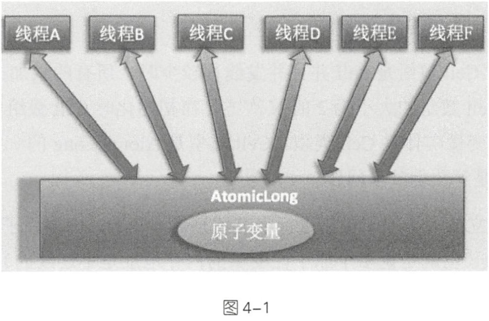
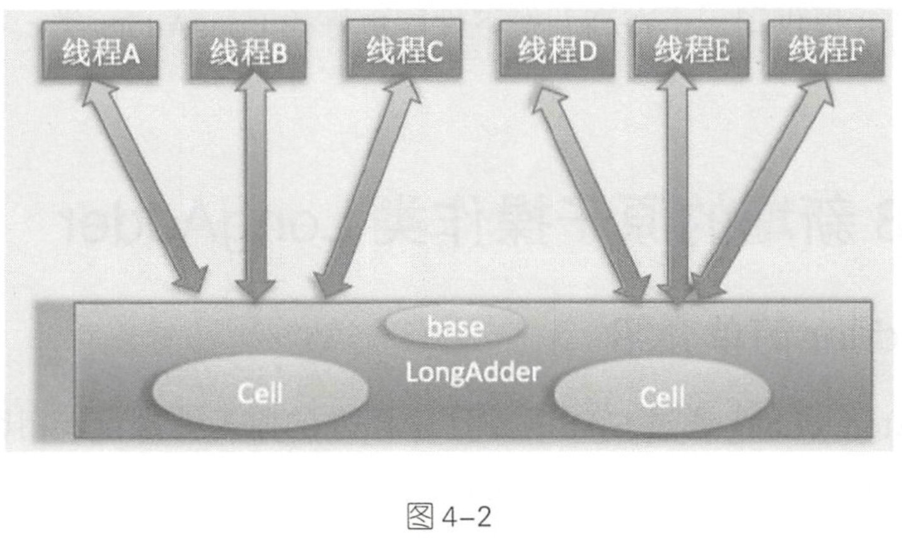

# Java并发包中原子操作类原理剖析
## 目录

- [原子操作变量类](#1)
  - [递增和递减操作代码](#2)
  - [boolean compareAndSet(long expecte,long update)](#3)
- [JDK8新增的原子操作类LongAdder](#4)
  - [源码分析](#5)
  - [小结](#6)
- [LongAccumulator类原理探究](#7)

JUC 包提供了一系列的原子性操作类，这些类都是使用非阻塞算法CAS实现的，相比使用锁实现原子性操作这在性能上有很大提高。由于原子性操作类的原理都大致相同， 所以本章只讲解最简单的 AtomicLong类的实现原理以及 JDK 8中新增的LongAdder和LongAccumulator类的原理。有了这些基础 ， 再去理解其他原子性操作类的实现就不会感到困难了 。 

<h2 id='1'>原子操作变量类</h2>
JUC并发包中含有AtomicInteger、AtomicLong和AtomicBoolean等原子性操作类，它们的原理类似，下面以AtomicLong为例进行讲解。AtomicLong是原子性递增或者递减类，其内部使用Unsafe实现，我们来看下面的代码。

```java
public class AtomicLong extends Number implements java.io.Serializable{
	private static final long serialVersionUID=1927816293512124184L;
	
	//(1)获取Unsafe实例
	private static final Unsafe = Unsafe.getUnsafe();
	
	//(2)存放变量value的偏移量
	private staitc final lnog valueOffset;
  
  //(3)判断JVM是否支持Long类型无锁CAS
  static final boolean VM_SUPPORTS_LONG_CAS=VMSupportsCS8();
  private static native boolean VMSupportsCS8();
  static{
    try{
      //(4)获取value在AtomicLong的偏移量
      valueOffset=unsafe.objectFieldOffset
        		(AtomicLong.class.getDeclaredField("value"));
    }catch(Exception ex){
      throw new Error(ex);
    }
  }
    //(5)实际变量值
    private volatile long value;
    
  public AtomicLong(long initialValue){
    value=initialValue;
  }
   ....
  
}
```

代码(1)通过Unsafe.getUnsafe()方法获取到Unsafe类的实例，这里你可能会有疑问，为何能通过Unsafe.getUnsafe()方法获取到Unsafe的实例呢？这是因为AtomicLong类也是在rt.jar包下面的，AtomicLong类就是通过Bootstrap类加载器进行加载的。代码(5)中的value被声明为volatile，这是为了多线程下保证内存可见性，value是具体存放计数的变量。代码(2)(3)(4)获取value变量在AtomicLong类中的偏移量。

下面重点看下AtomicLong中的主要函数

<h3 id='2'> 递增和递减操作代码</h3>
```java
//(6)调用unsafe方法，原子性设置value值为原始值+1，返回值为递增后的值
public final long incrementAndGet(){
   return unsafe.getAndAddLong(this,valueOffset,1L)+1L;
}

//(7)调用unsafe方法，原子性设置value值为原始值-1，返回值为递减后的值
public final long decrementAndGet(){
   return unsafe.getAndAddLong(this,valueOffset,1L)-1L;
}

//(8)调用unsafe方法，原子性设置value值为原始值+1，返回值为原始值
public final long getAndIncrement(){
   return unsafe.getAndAddLong(this,valueOffset,1L);
}
//(9)调用unsafe方法，原子性设置value值为原始值-1，返回值为原始值
public final long getAndDecrement(){
   return unsafe.getAndAddLong(this,valueOffset,-1L);
}
```

在如上代码内部都是通过Unsafe的getAndAddLong方法来实现操作，这个函数是个原子性操作。

这里第一个参数是AtomicLong实例的引用，第二个参数是value变量在AtomicLong中的偏移值，第三个参数是要设置第二个变量的值。

可以看到上述四个方法都是基于Unsafe类的getAndAddLong方法实现的

JDK8中的unsafe.getAndLong源码如下

```java
public final long getAndAddLong(Object paramObject, long paramLong1, long paramLong2){
  	long l;
   	do{
      1=getLongvolatile(paramObject,paramLong1);
    }while(!compareAndSwapLong(paramObject, paramLong1,1,1+papramLong2));
 		return l;
}
```

<h3 id='3'>
boolean  compareAndSet(long expect, long update)方法
</h3>

```java
public final boolean compareAndSet(long expect, long update){
  return unsafe.compareAndSwapLong(this,valueOffset,expect,update);
}
```

由上面代码可知，内部还是调用了unsafe.compareAndSwapLong方法，如果原子变量中的value值等于expect，则使用update值更新该值并返回true，否则返回false。

看完书上的讲解，其实还是有点模糊，我们利用一个多线程使用AtomicLong统计0的个数的例子来加深对AtoicLong的理解

```java
public class Atomic {                                                                        
    //(10)创建Long型原子计数器                                                                       
    private static AtomicLong atomicLong=new AtomicLong();                                   
    //(11)创建数据源                                                                              
    private static Integer[]arrayOne=new Integer[]{0,1,2,3,0,5,0,6,56,0};                    
    private static Integer[]arrayTwo=new Integer[]{10,1,2,3,0,5,0,6,56,0};                   
                                                                                             
    public static void main (String[]args) throws InterruptedException{                      
        Thread threadone=new Thread(new Runnable() {                                         
            @Override                                                                        
            public void run() {                                                              
                int size=arrayOne.length;                                                    
                for(int i=0;i<size;i++){                                                     
                    if(arrayOne[i].intValue()==0){                                           
                        atomicLong.incrementAndGet();                                        
                    }                                                                        
                }                                                                            
            }                                                                                
        });                                                                                  
                                                                                             
        Thread threadtwo=new Thread(new Runnable() {                                         
            @Override                                                                        
            public void run() {                                                              
                int size=arrayTwo.length;                                                    
                for(int i=0;i<size;i++){                                                     
                    if(arrayTwo[i].intValue()==0){                                           
                        atomicLong.incrementAndGet();                                        
                    }                                                                        
                }                                                                            
            }                                                                                
        });                                                                                  
        threadone.start();                                                                   
        threadtwo.start();                                                                   
                                                                                             
        threadone.join();                                                                    
        threadtwo.join();                                                                    
                                                                                             
        System.out.println("count 0:"+atomicLong.get());                                     
    }                                                                                                                                                                                     
}                                                                                            
                                                                                             
```

输出结果为: 

count 0:7

如上代码中的两个线程各自统计自己所持数中0的个数，每当找到一个0就会调用AtomicLong的原子性递增方法。

在没有原子类的情况下，实现计数器需要一定的同步措施，比如使用synchronized关键字等，但是这些都是阻塞算法，对性能有一定损耗，而本章介绍的这些原子操作类都使用CAS非阻塞算法，性能更好。但是在高并发情况下AtomicLong还会存在性能问题，大量线程会去竞争更新同一个原子变量，由于同时只有一个线程的CAS会成功，会造成大量的自旋尝试，十分浪费CPU资源。JDK8提供了在高并发下性能更好的LongAdder类。

<h2 id='4'>JDK8新增的原子操作类LongAdder</h2>
JDK8新增了一个原子性递增或者递减类LongAdder用来克服在高并发下使用AtomicLong的缺点。既然AtomicLong的性能瓶颈是由于过多线程去竞争一个变量的更新而产生的，那么如果把一个变量分解为多个变量，让同样多的线程去竞争多个资源，是不是就解决了性能问题！是的哦！！LongAdder就是这样的思路。


如图4-1所示，使用AtomicLong时是多个线程同时竞争同一个源自变量

如图4-2所示，使用LongAdder时，则是在内部维护多个Cell变量，每个Cell里面有一个初始值为0的long型变量，这样，在同等并发量的情况下，争夺单个变量更新操作的线程量会减少，这变相地减少了争夺共享资源的并发量。另外，多个线程在争夺同一个Cell原子变量时如果失败了，它并不是在当前Cell变量上一直自旋CAS重试，而是尝试在其他Cell的变量上进行CAS尝试，这个改变增加了当前线程重试CAS成功的可能性。最后，在获取LongAdder当前值时，是把所有Cell变量的value值累加后再加上base返回的。

LongAdder维护了一个延迟初始化的原子性更新数组（默认情况下Cell数组是null）和一个基值变量base。由于Cells占用的内存是相对比较大的，所以一开始并不创建它，而是在需要时创建，也就是惰性加载。

当一开始判断 Cell 数组是 null 并且并发线程较少时，所有的累加操作都是对base变量进行的。保持Cel数组的大小为2的N次方，在初始化时Cell数组中的Cell元素个数为2，数组里面的变量实体是Cell类型。 Cell类型是 tomicLong的一个改进，用来减少缓存的争用，也就是解决伪共享问题 。 

对于大多数孤立的多个原子操作进行字节填充是浪费的，因为原子性操作都是无规律 

地分散在内存中的 (也就是说多个原子性变量的内存地址是不连续的)， 多个原子变量被放入同一个缓存行的可能性很小 。 但是原子性数组元素的内存地址是连续的，所以数组内的多个元素能经常共享缓存行，因此这里使用 @sun.misc.Contended注解对 Cell类进行字节填充，这防止了数组中多个元素共享一个缓存行，在性能上是一个提升 。 

下面围绕以下话题从源码角度来分析 LongAdder 的实现 : 

(1)LongAdder 的结构是怎样的? (2)当前线程应该访问 Cell 数组里面的哪一个 Cell 元素? (3)如何初始化 Cell 数组? C4) Cell 数组如何扩容? (5)线程访问分配的 Cell 元素有冲突后如何处理? (6)如何保证线程操作被分配的 Cell元素的原子性?

<h3 id='4'> 源码分析</h3>

先看LongAdder的定义

```java
public class LongAdder extends Striped64 implements Serializable
```

Striped64类中有三个变量

```java
transient volatile Cell[] cells;

transient volatile long base;

transient volatile int cellsBusy;
```

因此，LongAdder类继承自Sriped64类，在striped64内维护着三个变量。LongAdder的真实值其实是base的值与Cells数组里面所有Cell数组里面所有Cell元素中的value值的累加，base是个基础值，默认为0。cellsBusy用来使用实现自旋锁，状态只有0和1，当创建Cell元素，扩容Cell数组或者初始化Cell数组时，使用CAS操作该变量来保证同时只有一个线程可以进行其中之一的操作。

下面看Cell的定义：

```java
@sun.misc.Contended static final class Cell {
    volatile long value;
    Cell(long x) { value = x; }
    final boolean cas(long cmp, long val) {
        return UNSAFE.compareAndSwapLong(this, valueOffset, cmp, val);
    }

    // Unsafe mechanics
    private static final sun.misc.Unsafe UNSAFE;
    private static final long valueOffset;
    static {
        try {
            UNSAFE = sun.misc.Unsafe.getUnsafe();
            Class<?> ak = Cell.class;
            valueOffset = UNSAFE.objectFieldOffset
                (ak.getDeclaredField("value"));
        } catch (Exception e) {
            throw new Error(e);
        }
    }
}
```

可以看到Cell的构造比较简单，内部维护了一个被声明为volatile的变量，这里声明为volatile是因为线程操作value变量时没有使用锁，为了保证变量的内存可见性。另外cas函数通过CAS操作，保证了当前线程更新时被分配的Cell元素中value值的原子性。另外Cell类使用@sun.misc.Contended修饰是为了避免伪共享。

下面来看LongAdder中的几个方法：

- long Sum()

  ```java
  public long sum() {
      Cell[] as = cells; Cell a;
      long sum = base;
      if (as != null) {
          for (int i = 0; i < as.length; ++i) {
              if ((a = as[i]) != null)
                  sum += a.value;
          }
      }
      return sum;
  }
  ```

  返回当前的值，内部操作是累加所有 Cell 内部的 value值后再累加 base。例如下面的代码， 由于计算总和时没有对 Cell 数组进行加锁，所以在累加过程中可能有其他线程对 Cell 中的值进行了修改， 也有可能对数组进行了扩容，所以 sum返回的值并不是非常精确的。

- void reset()

```java
public void reset() {
    Cell[] as = cells; Cell a;
    base = 0L;
    if (as != null) {
        for (int i = 0; i < as.length; ++i) {
            if ((a = as[i]) != null)
                a.value = 0L;
        }
    }
}
```

reset函数非常简单，就是将base和Cell数组中非空元素全部置为0

- long sumThenRest()

```java
public long sumThenReset() {
    Cell[] as = cells; Cell a;
    long sum = base;
    base = 0L;
    if (as != null) {
        for (int i = 0; i < as.length; ++i) {
            if ((a = as[i]) != null) {
                sum += a.value;
                a.value = 0L;
            }
        }
    }
    return sum;
}
```

sumThenReset也比较简单，将某个Cell的值加到sum后随即重置。

- void add(long x)

```java
public void add(long x) {
    Cell[] as; long b, v; int m; Cell a;
    // 判断cells是否为空，如果不为空则直接进入内层判断，
    // 否则尝试通过CAS在base上进行add操作，若CAS成功则结束，否则进入内层
    if ((as = cells) != null || !casBase(b = base, b + x)) {
        // 记录cell上的CAS操作是否失败
        boolean uncontended = true;
        if (as == null || (m = as.length - 1) < 0 ||
            // 计算当前线程应该访问cells数组的哪个元素
            (a = as[getProbe() & m]) == null ||
            // 尝试通过CAS操作在对应cell上add,如果没有映射或者CAS操作失败则进入longAccumulate代码
            !(uncontended = a.cas(v = a.value, v + x)))
            longAccumulate(x, null, uncontended);
    }
}
```

add方法会判断cells数组是否为空，非空则进入内层，否则尝试直接通过CAS操作在base上进行add。内层代码中，声明了一个uncontented变量来记录调用longAccumulate方法前在相应cell上是否进行了失败的CAS操作。

下面重点看longAccumulate代码逻辑，这是cells数组被初始化和扩容的地方

```java
final void longAccumulate(long x, LongBinaryOperator fn,
                              boolean wasUncontended) {
    int h;
    if ((h = getProbe()) == 0) {
        ThreadLocalRandom.current(); // 初始化当前线程的probe，以便于找到线程对应的cell
        h = getProbe();
        wasUncontended = true; // 标记执行longAccumulate前对相应cell的CAS操作是否失败，失败为false
    }
    boolean collide = false; // 是否冲突，如果当前线程尝试访问的cell元素与其他线程冲突，则为true
    for (;;) {
        Cell[] as; Cell a; int n; long v;
        // 当前cells不为空且元素个数大于0则进入内层，否则尝试初始化
        if ((as = cells) != null && (n = as.length) > 0) {
            if ((a = as[(n - 1) & h]) == null) {
                if (cellsBusy == 0) {       // 尝试添加新的cell
                    Cell r = new Cell(x);
                    if (cellsBusy == 0 && casCellsBusy()) {
                        boolean created = false;
                        try {               // Recheck under lock
                            Cell[] rs; int m, j;
                            if ((rs = cells) != null &&
                                (m = rs.length) > 0 &&
                                rs[j = (m - 1) & h] == null) {
                                rs[j] = r;
                                created = true;
                            }
                        } finally {
                            cellsBusy = 0;
                        }
                        if (created)
                            break;
                        continue;
                    }
                }
                collide = false;
            }
            else if (!wasUncontended)  // 如果已经进行了失败的CAS操作
                wasUncontended = true; // 则不调用下面的a.cas()函数（反正肯定是失败的）,而是重新计算probe值来尝试
            else if (a.cas(v = a.value, ((fn == null) ? v + x :fn.applyAsLong(v, x))))
                break;
            else if (n >= NCPU || cells != as)
                collide = false; // 如果当前cells长度大于CPU个数则不进行扩容，因为每个cell都使用一个CPU处理时性能才是最高的
                                 // 如果当前cells已经过时（其他线程对cells执行了扩容操作，改变了cells指向），也不会扩容
            else if (!collide)
                collide = true;  // 执行到此处说明a.cas()执行失败，即有冲突，将collide置为true，
                                 // 跳过扩容阶段，重新获取probe，到cells不同位置尝试cas，再次失败则扩容
            // 扩容
            else if (cellsBusy == 0 && casCellsBusy()) {
                try {
                    if (cells == as) {      
                        Cell[] rs = new Cell[n << 1];
                        for (int i = 0; i < n; ++i)
                            rs[i] = as[i];
                        cells = rs;
                    }
                } finally {
                    cellsBusy = 0;
                }
                collide = false;
                continue; // 扩容后再次尝试（扩容后cells长度改变，
                          // 根据(n - 1) & h计算当前线程在cells中对应元素下标会变化，减少再次冲突的可能性）
            }
            h = advanceProbe(h); // 重新计算线程probe，减小下次访问cells元素时的冲突机会
        }
        // 初始化cells数组
        else if (cellsBusy == 0 && cells == as && casCellsBusy()) {
            boolean init = false;
            try {                           
                if (cells == as) {
                    Cell[] rs = new Cell[2];
                    rs[h & 1] = new Cell(x);
                    cells = rs;
                    init = true;
                }
            } finally {
                cellsBusy = 0;
            }
            if (init)
                break;
        }
        // 尝试通过base的CAS操作进行add，成功则结束当前函数，否则再次循环
        else if (casBase(v = base, ((fn == null) ? v + x :fn.applyAsLong(v, x))))
            break; 
    }
}
```

代码比较复杂，细节的解释都写在注释中了。大体逻辑就是判断cells是否为空或者长度为0：如果空或者长度为0则尝试进行cells数组初始化，初始化失败的话则尝试通过CAS操作在base上进行add，仍然失败则重走一次流程；如果cells不为空且长度大于0，则获取当前线程对应于cells中的元素，如果该元素为null则尝试创建，否则尝试通过CAS操作在上面进行add，仍失败则扩容。

<h3 id='6'>小结</h3>

本节介绍了JDK8中新增的LongAdder原子性操作类，该类通过内部cells数组分担了高并发下多线程同时对一个原子进行更新时的竞争量，另外，数组Cell使用 @sun.misc.Contended注解进行了修饰，这避免了cells数组内多个原子变量被放入同一个缓存行，也就是避免了伪共享，这对性能是一个提升。

<h3 id='7'>LongAccumulator类原理探究</h3>

LongAdder类是LongAcuumulator的一个特例，LongAccumulator比LongAdder的功能更加强大。

例如下面的构造函数，其中accumulatorFunction是一个双目运算器接口，其根据输入的两个参数返回一个计算值，identity则是LongAccumulator累加器的初始值。

```java
public LongAccumulator(LongBinaryOperator accumulatorFunction,
                        long identity) {
    this.function = accumulatorFunction;
    base = this.identity = identity;
}

public interface LongBinaryOperator {
  //根据两个参数计算并返回一个值
    long applyAsLong(long left, long right);
}
```

LongAccumulator相比LongAdder的不同在于，在调用casBase时候后者传递的是b+x，前者则使用了r=function.applyAsLong(b=base,x)来计算

另外，前者在调用longAccumulate时传递的是function，而后者是null。
